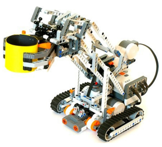
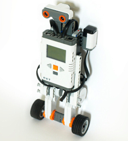

# LEGO Mindstorms NXT RobotC projects

This repository includes programms for LEGO Mindstorms NXT 2.0 set written in the [RobotC language](https://www.robotc.net/).

The repository includes programs for the following robots:
1. **Snatcher: the autonomous robotic arm.**

It is an autonomous robotic arm that can find and pick up objects. The Snatcher uses two NXT motors to control a set of treads, allowing the robot to move in any direction. 

Instructions for building and programming this robot are included in The LEGO MINDSTORMS NXT 2.0 Discovery Book.

2. **Segway: basic segway robotic platform.**

[Description](http://robotsquare.com/2012/02/13/tutorial-segway-with-robotc/)

3. **Color sorter: simple robot for sorting cubes by color**

The repository also includes various examples of writing programs in the RobotC language.
